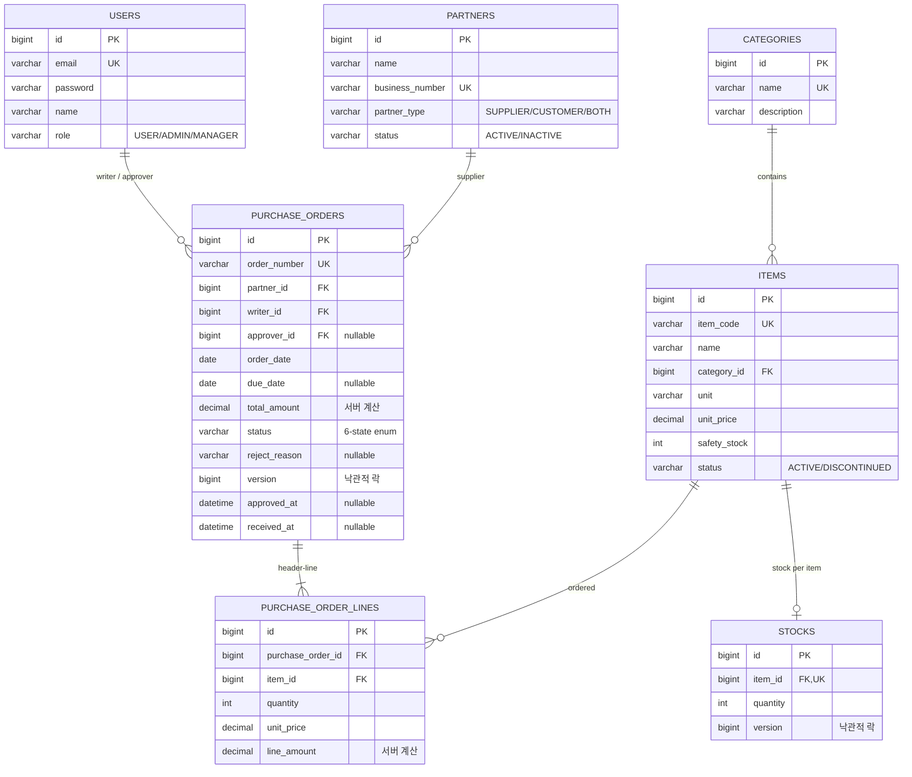

# ERD (엔티티 관계도)

SCM 시스템의 엔티티/테이블 구조입니다. **실제 도메인 클래스(`domain/**`)와 JPA 매핑을 기준**으로 작성했습니다.

- Java 필드는 camelCase, DB 컬럼/테이블은 snake_case입니다.
- enum은 `@Enumerated(EnumType.STRING)`로 문자열 저장됩니다.
- `createdAt`/`updatedAt`은 `BaseTimeEntity`(`@MappedSuperclass` + JPA Auditing)에서 상속합니다(`PurchaseOrderLine` 제외).

---

## 1. 관계 개요

```text
User ──writerId(N:1)────────┐
User ──approverId(N:1,null)─┤
Partner ──partnerId(N:1)────┤
                            ▼
                     PurchaseOrder (발주 헤더, @Version)
                            │ 1:N  @OneToMany(cascade=ALL, orphanRemoval=true)
                            ▼
                  PurchaseOrderLine (발주 라인) ──itemId(N:1)──▶ Item
                                                                  │
Category ──categoryId(1:N)──▶ Item                                │ 입고 시 itemId 기준 수량 증가
                                                                  ▼
                                                          Stock (재고, itemId UNIQUE, @Version)
```

- **모듈 내부 관계**(`PurchaseOrder` ↔ `PurchaseOrderLine`)만 JPA 연관관계(`@OneToMany`/`@ManyToOne`)로 매핑합니다.
- **외부 마스터 참조**(`User`/`Partner`/`Item`)는 연관 엔티티가 아니라 **FK ID(Long) 컬럼**으로 보관합니다. 표시값(거래처명/품목명/작성자명)은 Service가 조회해 DTO에 채웁니다(OSIV off).
- `Stock`은 입고(`RECEIVED`) 시 `itemId` 기준으로 1행씩 관리하며, 행이 없으면 생성합니다.

## 2. Mermaid ERD



---

## 3. 테이블 컬럼 요약

### 3.1 users

| 컬럼 | 타입 | 제약 | 설명 |
|---|---|---|---|
| id | BIGINT | PK, AUTO_INCREMENT | 사용자 ID |
| email | VARCHAR(100) | NOT NULL, UNIQUE | 로그인 이메일 |
| password | VARCHAR(255) | NOT NULL | BCrypt 해시 |
| name | VARCHAR(50) | NOT NULL | 이름 |
| role | VARCHAR(20) | NOT NULL | `UserRole` (USER/ADMIN/MANAGER) |
| created_at / updated_at | DATETIME | NOT NULL / NULL | 감사 |

### 3.2 partners

| 컬럼 | 타입 | 제약 | 설명 |
|---|---|---|---|
| id | BIGINT | PK, AUTO_INCREMENT | 거래처 ID |
| name | VARCHAR(150) | NOT NULL | 거래처명 |
| business_number | VARCHAR(20) | NOT NULL, UNIQUE | 사업자번호 |
| partner_type | VARCHAR(20) | NOT NULL | `PartnerType` (SUPPLIER/CUSTOMER/BOTH) |
| contact_name | VARCHAR(50) | NULL | 담당자명 |
| phone | VARCHAR(30) | NULL | 연락처 |
| email | VARCHAR(100) | NULL | 이메일 |
| address | VARCHAR(255) | NULL | 주소 |
| status | VARCHAR(20) | NOT NULL | `PartnerStatus` (ACTIVE/INACTIVE), 기본 ACTIVE |
| created_at / updated_at | DATETIME | NOT NULL / NULL | 감사 |

### 3.3 categories

| 컬럼 | 타입 | 제약 | 설명 |
|---|---|---|---|
| id | BIGINT | PK, AUTO_INCREMENT | 카테고리 ID |
| name | VARCHAR(100) | NOT NULL, UNIQUE | 카테고리명 |
| description | VARCHAR(255) | NULL | 설명 |
| created_at / updated_at | DATETIME | NOT NULL / NULL | 감사 |

### 3.4 items

| 컬럼 | 타입 | 제약 | 설명 |
|---|---|---|---|
| id | BIGINT | PK, AUTO_INCREMENT | 품목 ID |
| item_code | VARCHAR(50) | NOT NULL, UNIQUE | 품목코드 |
| name | VARCHAR(150) | NOT NULL | 품목명 |
| category_id | BIGINT | NOT NULL (FK → categories.id) | 소속 카테고리 |
| unit | VARCHAR(20) | NOT NULL | 단위(EA/BOX/KG 등) |
| unit_price | DECIMAL(15,2) | NOT NULL | 표준단가 |
| safety_stock | INT | NOT NULL | 안전재고, 기본 0 |
| status | VARCHAR(20) | NOT NULL | `ItemStatus` (ACTIVE/DISCONTINUED), 기본 ACTIVE |
| created_at / updated_at | DATETIME | NOT NULL / NULL | 감사 |

> `category_id`는 ID 참조이지만 DB FK 제약은 유지됩니다.

### 3.5 purchase_orders (발주 헤더)

| 컬럼 | 타입 | 제약 | 설명 |
|---|---|---|---|
| id | BIGINT | PK, AUTO_INCREMENT | 발주서 ID |
| order_number | VARCHAR(30) | NOT NULL, UNIQUE (`uk_po_order_number`) | 발주번호 `PO-YYYYMMDD-####` |
| partner_id | BIGINT | NOT NULL (FK → partners.id) | 공급사 |
| writer_id | BIGINT | NOT NULL (FK → users.id) | 작성자 |
| approver_id | BIGINT | NULL (FK → users.id) | 승인/반려 처리자 (ADMIN/MANAGER) |
| order_date | DATE | NOT NULL | 발주일 |
| due_date | DATE | NULL | 납기일 |
| total_amount | DECIMAL(15,2) | NOT NULL | 총금액 (서버 계산 = Σ line_amount) |
| status | VARCHAR(30) | NOT NULL | `PurchaseOrderStatus`, 기본 DRAFT |
| reject_reason | VARCHAR(500) | NULL | 반려 사유 |
| version | BIGINT | NOT NULL | 낙관적 락(`@Version`) |
| created_at / updated_at | DATETIME | NOT NULL / NULL | 감사 |
| approved_at | DATETIME | NULL | 승인 시각 |
| received_at | DATETIME | NULL | 입고 시각 |

인덱스: `idx_po_writer(writer_id)`, `idx_po_status(status)`, `idx_po_partner(partner_id)`, `idx_po_created_at(created_at)`.

### 3.6 purchase_order_lines (발주 라인)

| 컬럼 | 타입 | 제약 | 설명 |
|---|---|---|---|
| id | BIGINT | PK, AUTO_INCREMENT | 라인 ID |
| purchase_order_id | BIGINT | NOT NULL (FK → purchase_orders.id, `fk_pol_po`) | 발주서 |
| item_id | BIGINT | NOT NULL (FK → items.id) | 품목 |
| quantity | INT | NOT NULL | 수량(> 0) |
| unit_price | DECIMAL(15,2) | NOT NULL | 단가(≥ 0, null이면 품목 표준단가) |
| line_amount | DECIMAL(15,2) | NOT NULL | 라인 금액 (서버 계산 = quantity × unit_price) |

인덱스: `idx_pol_po(purchase_order_id)`, `idx_pol_item(item_id)`.

> 라인은 헤더에 종속된 aggregate child입니다. 단독 저장하지 않고 항상 헤더 cascade로 저장합니다. `BaseTimeEntity`를 상속하지 않습니다(생성/수정 시각 불필요).

### 3.7 stocks (재고)

| 컬럼 | 타입 | 제약 | 설명 |
|---|---|---|---|
| id | BIGINT | PK, AUTO_INCREMENT | 재고 ID |
| item_id | BIGINT | NOT NULL, UNIQUE (`uk_stock_item`, FK → items.id) | 품목(품목당 1행) |
| quantity | INT | NOT NULL | 현재고, 기본 0 |
| version | BIGINT | NOT NULL | 낙관적 락(`@Version`) |
| created_at / updated_at | DATETIME | NOT NULL / NULL | 감사 |

> 입고 처리 시 라인별로 `findByItemId` → 없으면 `quantity=0`으로 생성 후 `increase(quantity)`. `item_id` UNIQUE 제약이 동시 최초 생성의 최종 방어선입니다.

---

## 4. enum 정의

| enum | 값 | 사용 엔티티 |
|---|---|---|
| `UserRole` | `USER`, `ADMIN`, `MANAGER` | User |
| `PartnerType` | `SUPPLIER`, `CUSTOMER`, `BOTH` | Partner |
| `PartnerStatus` | `ACTIVE`, `INACTIVE` | Partner |
| `ItemStatus` | `ACTIVE`, `DISCONTINUED` | Item |
| `PurchaseOrderStatus` | `DRAFT`, `REQUESTED`, `APPROVED`, `REJECTED`, `RECEIVED`, `CANCELED` | PurchaseOrder |

### PurchaseOrderStatus 의미

| 값 | 의미 | 종료 여부 |
|---|---|---|
| `DRAFT` | 작성됨(임시저장), 결재 요청 전 | 비종료 |
| `REQUESTED` | 결재 요청됨, 승인/반려 대기 | 비종료 |
| `APPROVED` | 승인됨, 입고 대기 (입고 또는 취소 가능) | 비종료 |
| `REJECTED` | 반려됨 | 종료 |
| `RECEIVED` | 입고 완료 (+재고 증가) | 종료 |
| `CANCELED` | 취소됨 | 종료 |

> 발주 상태 전이 규칙(T1~T8, 금지 전이)은 [`STATE_MACHINE.md`](STATE_MACHINE.md)를 참고하세요.

---

## 5. 발주 모듈 외부 의존 제약

| 참조 대상 | 방향 | 발주가 의존하는 제약 | 검증 위치 |
|---|---|---|---|
| Partner | 읽기 | `partnerType ∈ {SUPPLIER, BOTH}`, `status = ACTIVE` | `PurchaseOrderService.create` |
| Item | 읽기 | `status ≠ DISCONTINUED`, 표준단가(`unitPrice`) 기본값 출처 | `PurchaseOrderService.resolveLine` |
| User | 읽기 | `writerId`(작성자), `approverId`(ADMIN/MANAGER 처리자) | 세션/권한 |
| Item(via Stock) | 쓰기 | 입고 시 `itemId` 기준 재고 증가 | `PurchaseOrderService.receive` |
