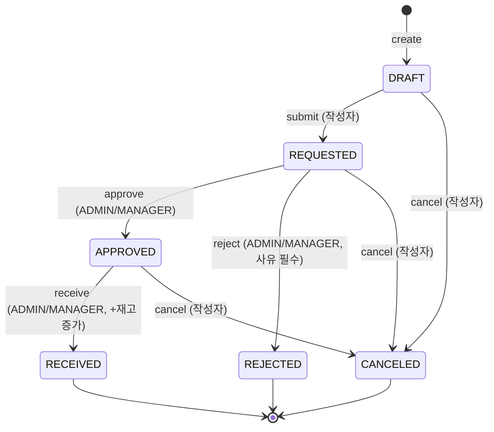

# 발주 상태 전이 (State Machine)

발주(PurchaseOrder)의 상태 전이 규칙입니다. **실제 도메인 메서드(`PurchaseOrder.submit/approve/reject/receive/cancel`)와 서비스(`PurchaseOrderService`) 구현을 기준**으로 작성했습니다.

- 상태 가드는 **엔티티 도메인 메서드 내부**(`requireStatus`/`requireCancelable`)에서 검증하며, 위반 시 `INVALID_STATUS`(400)를 던집니다.
- 권한 가드는 **Service 진입부**에서 검증합니다. "작성자 본인"(submit/cancel)과 "역할 등급"(approve/reject/receive)을 구분합니다.

---

## 1. 상태 다이어그램

```text
        create (orderNumber 채번, totalAmount/lineAmount 서버 계산)
          │
          ▼
       [DRAFT] ──submit──▶ [REQUESTED] ──approve──▶ [APPROVED] ──receive(+재고 증가)──▶ [RECEIVED] ✓
          │                    │                         │
          │                    └──reject(사유,approverId)──▶ [REJECTED] ✓
          │                    │                         │
          └───cancel───┐  ┌────cancel          ┌──cancel─┘   (T8: APPROVED→CANCELED)
                       ▼  ▼                     ▼
                    [CANCELED] ✓ ◀──────────────┘

✓ 종료(terminal) 상태: REJECTED, RECEIVED, CANCELED
  비종료 상태: DRAFT, REQUESTED, APPROVED
  취소 가능: DRAFT, REQUESTED, APPROVED   |   취소 불가: RECEIVED (및 종료 상태)
```

### Mermaid



---

## 2. 허용 전이표 (T1~T8)

| # | 현재 상태 | 액션(트리거) | 다음 상태 | 권한 | 부수효과(기록 필드) | 도메인 메서드 |
|---|---|---|---|---|---|---|
| T1 | (없음) | create `POST /api/purchase-orders` | DRAFT | 로그인 사용자 | orderNumber 채번, writerId, totalAmount/lineAmount 서버 계산, status=DRAFT, createdAt | (빌더 + addLine) |
| T2 | DRAFT | submit `PATCH .../submit` | REQUESTED | 작성자 본인 | status, updatedAt | `submit()` |
| T3 | REQUESTED | approve `PATCH .../approve` | APPROVED | ADMIN/MANAGER | status, approverId, approvedAt | `approve(approverId)` |
| T4 | REQUESTED | reject `PATCH .../reject` (사유 필수) | REJECTED | ADMIN/MANAGER | status, rejectReason, approverId | `reject(approverId, reason)` |
| T5 | APPROVED | receive `PATCH .../receive` | RECEIVED | ADMIN/MANAGER | status, receivedAt, **라인별 Stock.quantity 증가** | `receive()` + Service |
| T6 | DRAFT | cancel `PATCH .../cancel` | CANCELED | 작성자 본인 | status, updatedAt | `cancel()` |
| T7 | REQUESTED | cancel | CANCELED | 작성자 본인 | status, updatedAt | `cancel()` |
| T8 | APPROVED | cancel | CANCELED | 작성자 본인 | status, updatedAt | `cancel()` |

> T6~T8의 취소 권한은 **작성자 본인**(권한 등급 무관)입니다. 취소 사유는 받지 않습니다. APPROVED 취소는 아직 재고가 증가하기 전이므로 재고 롤백이 필요 없습니다(RECEIVED만 취소 불가).

---

## 3. 금지 전이 → 예외

상태 가드(`requireStatus`/`requireCancelable`) 위반은 모두 `INVALID_STATUS`(400)입니다.

| 시도 | 결과 |
|---|---|
| DRAFT → approve / reject / receive | 금지 (REQUESTED만 승인/반려, APPROVED만 입고) |
| REQUESTED → receive | 금지 |
| APPROVED → reject / submit | 금지 (이미 승인된 발주 반려 불가) |
| **RECEIVED → cancel** | 금지 (재고가 이미 반영됨) |
| REJECTED / RECEIVED / CANCELED → 모든 전이 | 금지 (종료 상태) |
| REJECTED / CANCELED → submit (재요청) | 금지 (재발주는 신규 작성) |

`cancel()`의 가드는 `requireCancelable()`이며, 허용 상태는 `{DRAFT, REQUESTED, APPROVED}`입니다.

```java
private void requireCancelable() {
    if (this.status != PurchaseOrderStatus.DRAFT
            && this.status != PurchaseOrderStatus.REQUESTED
            && this.status != PurchaseOrderStatus.APPROVED) {
        throw new BusinessException(ErrorCode.INVALID_STATUS);
    }
}
```

---

## 4. 권한 / 검증 시점

### 4.1 권한 검사 위치

| 액션 | 권한 검사 | 구현 |
|---|---|---|
| create | 로그인 필요 | `Authz.requireLogin` |
| submit / cancel | 작성자 본인 | `requireWriter` (`writerId == loginUser.id()` 불일치 시 `ACCESS_DENIED`) |
| approve / reject / receive | 역할 등급 | `Authz.requireRole(ADMIN, MANAGER)` |
| 상세 조회 | 작성자 본인 또는 ADMIN/MANAGER | `requireDetailAccess` |

### 4.2 동시 승인 / 입고 (낙관적 락)

- `PurchaseOrder`와 `Stock`에 `@Version`이 있어, 두 사용자가 동시에 승인/입고하면 두 번째 커밋에서 `OptimisticLockingFailureException`이 발생합니다.
- 이 예외는 `ApiExceptionHandler`가 **`INVALID_STATUS`(400)** 로 변환합니다("다른 사용자가 먼저 처리했습니다...").

### 4.3 입고 원자성

입고(`receive`)는 단일 `@Transactional`에서 다음을 수행합니다.

1. `findByIdWithLines(poId)`로 발주 + 라인을 fetch join 조회.
2. `po.receive()` — 상태 `APPROVED` 검증 후 `RECEIVED` + `receivedAt` 기록.
3. 라인별로 `Stock`을 조회(없으면 생성)해 `quantity`를 증가.

상태 전이와 모든 라인의 재고 증가가 같은 트랜잭션이므로, 한 라인이라도 실패하면 상태 변경을 포함해 전체 롤백됩니다. `RECEIVED` 상태는 재진입 시 `requireStatus(APPROVED)`에 막혀 이중 재고 증가가 방지됩니다.

---

## 5. 화면 버튼 노출 플래그

발주 상세 화면의 액션 버튼은 컨트롤러/서비스가 계산한 boolean으로만 노출합니다(뷰에서 role 직접 판단 금지). `PurchaseOrderService.getDetailView`에서 계산합니다.

| 플래그 | 조건 |
|---|---|
| `canSubmit` | `status == DRAFT` && 작성자 본인 |
| `canCancel` | `status ∈ {DRAFT, REQUESTED, APPROVED}` && 작성자 본인 |
| `canApproveReject` | `status == REQUESTED` && role ∈ {ADMIN, MANAGER} |
| `canReceive` | `status == APPROVED` && role ∈ {ADMIN, MANAGER} |
