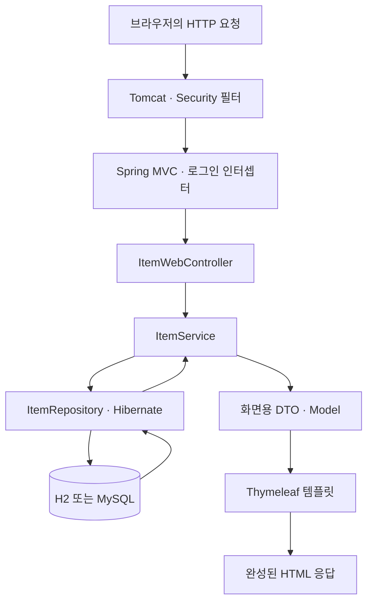

# 초보자를 위한 기술 안내: 무엇을, 왜, 어떻게 쓰나요?

> [처음 시작하기](./GETTING_STARTED.md) · [용어 사전](./GLOSSARY.md) · [문서 지도](./INDEX.md) · [코드 읽는 순서](../practice/REFERENCE_MAP.md)

이 프로그램은 **거래처와 품목을 등록하고, 발주를 승인한 뒤 입고 수량을 재고에 반영하는 웹 프로그램**입니다. 기술 이름부터 외우기보다 “이 기능을 만들려면 어떤 일이 필요한가?”를 먼저 생각해 보세요. 이 문서는 현재 저장소의 선택 이유와 실제 동작을 설명합니다.

처음에는 1~4절을 읽고 품목 화면을 한 번 사용해 보세요. 5~7절은 저장·로그인을 공부할 때, 8절은 직접 확인할 때 읽으면 됩니다. 설치 명령과 계정은 [처음 시작하기](./GETTING_STARTED.md), 모듈별 문제는 [워크북](../practice/README.md)에 있습니다.

## 1. 프로그램에 필요한 일과 기술 연결하기

**라이브러리**는 가져다 쓰는 기능 묶음이고, **프레임워크**는 요청 처리 같은 기본 흐름을 제공하는 틀입니다. 우리 코드는 그 흐름에 “품목을 어떻게 등록할지” 같은 업무 규칙을 채웁니다.

| 필요한 일 | 사용 기술 | 왜 들어갔나요? | 어떻게 동작하나요? / 읽을 파일 |
|---|---|---|---|
| 업무 규칙을 코드로 표현하고 실행하기 | Java 17, JVM | 품목·발주·재고를 객체로 표현하고 자료형으로 잘못된 사용을 줄입니다. | JDK가 `.java`를 바이트코드로 컴파일하고 JVM이 실행합니다. [Item](../src/main/java/com/example/scm/domain/Item.java) |
| 라이브러리 설치·컴파일·테스트 반복하기 | Gradle, Wrapper | 개발자마다 수동으로 파일을 모으지 않고 같은 빌드 절차를 실행합니다. | `./gradlew`가 지정된 Gradle을 사용해 [build.gradle](../build.gradle)의 작업을 수행합니다. |
| 웹 서버와 객체 연결 설정하기 | Spring Boot, Spring DI | 공통 설정과 객체 생성 코드를 줄이고 업무 규칙에 집중합니다. | Boot가 의존성·설정에 맞춰 자동 설정하고 Spring이 관리 객체를 연결합니다. [ScmApplication](../src/main/java/com/example/scm/ScmApplication.java) |
| URL을 Java 메서드에 연결하기 | Spring MVC, 내장 Tomcat | HTTP 요청을 직접 해석하는 서버를 만들 필요가 없습니다. | Tomcat이 요청을 받고 MVC가 매핑된 Controller를 호출합니다. [ItemWebController](../src/main/java/com/example/scm/controller/web/ItemWebController.java) |
| 목록·입력 화면 만들기 | HTML, CSS, JavaScript, Thymeleaf | 서버의 품목 데이터를 화면에 표시하고 입력을 돕습니다. | Thymeleaf가 HTML을 완성하고, 브라우저가 CSS와 JavaScript를 적용합니다. [품목 목록 템플릿](../src/main/resources/templates/item/list.html) |
| 다른 프로그램과 데이터 주고받기 | JSON, Jackson 3 | 화면 HTML과 별개로 구조화된 API 데이터를 제공합니다. | MVC의 메시지 변환기가 JSON ↔ 요청·응답 객체를 변환합니다. [ItemApiController](../src/main/java/com/example/scm/controller/api/ItemApiController.java) |
| 잘못된 입력 거절하기 | Bean Validation, DTO | 필수값·양수·소수 자리수 규칙을 여러 곳에서 일관되게 검사합니다. | DTO의 제약을 `@Valid`로 검사한 뒤 Service를 호출합니다. [발주 작성 DTO](../src/main/java/com/example/scm/dto/purchaseorder/PurchaseOrderCreateRequest.java) |
| 객체를 DB에 저장·조회하기 | JPA, Hibernate, Spring Data JPA | 행을 객체로 옮기는 반복 작업과 기본 CRUD 코드를 줄입니다. | Repository 호출 → Hibernate의 SQL → DB 순으로 이어집니다. [ItemRepository](../src/main/java/com/example/scm/repository/ItemRepository.java) |
| 데이터를 보관하고 구조 변경하기 | H2, MySQL, Flyway | 처음에는 설치 부담 없이 연습하고, 이후 영속 DB와 변경 이력을 배웁니다. | 기본 H2는 메모리 DB, MySQL 프로필은 Flyway SQL로 테이블을 준비합니다. [기본 설정](../src/main/resources/application.yml), [MySQL 설정](../src/main/resources/application-mysql.yml) |
| 여러 변경을 함께 성공·취소하기 | Spring 트랜잭션, DB 잠금 | 입고 상태만 바뀌거나 동시 요청이 재고를 덮어쓰는 문제를 다룹니다. | Service가 작업 경계를 정하고 DB가 커밋·롤백·잠금을 수행합니다. [PurchaseOrderService](../src/main/java/com/example/scm/service/PurchaseOrderService.java) |
| 로그인과 역할 구분하기 | 세션, 인터셉터, Spring Security, BCrypt | 사용자를 기억하고 허용된 업무만 실행하게 합니다. | 세션 확인·업무 권한 검사·폼 CSRF 검사를 각 위치에서 수행합니다. [SecurityConfig](../src/main/java/com/example/scm/config/SecurityConfig.java) |
| 반복되는 Java 코드 줄이기 | Lombok | 생성자·getter 같은 기계적인 코드를 줄입니다. | 컴파일할 때 어노테이션에 맞는 코드를 생성합니다. [ItemService](../src/main/java/com/example/scm/service/ItemService.java) |
| 수정 후 정상·실패 동작 확인하기 | JUnit, Mockito, Spring Boot Test, MockMvc | 화면을 매번 수동으로 조작하지 않고 규칙과 계층 연결을 확인합니다. | 테스트 메서드 실행, 대역 객체, Spring·DB 통합 검증을 나누어 사용합니다. [테스트 폴더](../src/test/java/com/example/scm) |
| 같은 환경에서 실행·자동 검사하기 | Docker, Compose, GitHub Actions | 실행 환경을 재현하고 변경 시 검증을 반복합니다. | 컨테이너 이미지 빌드, app·DB 실행, CI 검사를 담당합니다. [Dockerfile](../Dockerfile), [Compose](../docker-compose.yml), [CI](../.github/workflows/ci.yml) |

모든 Java 프로그램에 이 기술들이 반드시 필요한 것은 아닙니다. 이 저장소에서는 **웹 요청 → 업무 규칙 → DB 저장 → 검증**을 한 프로젝트에서 익히기 위해 함께 사용합니다.

## 2. 실행 버튼을 누르면 무슨 일이 일어나나요?

저장소 루트에서 `./gradlew bootRun`을 실행하면 다음 일이 이어집니다.

1. **Gradle이 실행을 준비합니다.** 필요한 라이브러리를 내려받고 Java를 컴파일합니다. 이때 Lombok의 생성자·getter도 만들어집니다.
2. **JVM이 `ScmApplication.main()`을 실행합니다.** `SpringApplication.run(...)`이 Spring 애플리케이션을 시작합니다.
3. **Spring이 설정을 읽고 객체를 연결합니다.** `application.yml`과 활성 프로필을 적용하고 Controller·Service 및 Repository 구현 등을 준비합니다. Spring이 관리하는 객체를 **빈(Bean)**이라고 부릅니다.
4. **DB와 초기 데이터를 준비합니다.** 기본 H2에서는 Hibernate가 테이블을 만들고, 시드 설정이 켜져 있으면 [DataInitializer](../src/main/java/com/example/scm/init/DataInitializer.java)가 학습 데이터를 넣습니다. MySQL에서는 Flyway가 스키마를 관리합니다.
5. **내장 웹 서버가 요청을 받을 준비를 마칩니다.** 브라우저에서 접속하면 아래의 요청 흐름이 시작됩니다. 시작 중 DB 연결 실패 등이 나면 정상 준비까지 도달하지 못합니다.

위는 이해를 위한 주요 단계입니다. Spring 내부의 모든 초기화 이벤트 순서를 나열한 것은 아닙니다.

### `build.gradle`의 단어 읽기

- **플러그인**: 빌드에 기능을 추가합니다. `java`는 컴파일·테스트, Spring Boot 플러그인은 `bootRun`과 실행 가능한 `bootJar` 등을 제공합니다.
- **starter**: 한 기능에 함께 필요한 라이브러리 묶음입니다. 예를 들어 `spring-boot-starter-data-jpa`는 JPA 사용에 필요한 구성요소를 가져옵니다. 업무 코드를 대신 작성해 주지는 않습니다.
- **`implementation`**: 컴파일과 실행에 필요한 라이브러리입니다.
- **`runtimeOnly`**: 컴파일에는 직접 필요 없지만 실행할 때 필요한 라이브러리입니다. 이 프로젝트의 H2·MySQL JDBC 드라이버가 여기에 있습니다.
- **`compileOnly` / `annotationProcessor`**: Lombok 어노테이션을 컴파일 중 참조하고, 그 어노테이션을 처리해 코드를 생성하도록 지정합니다.
- **`testImplementation`**: 테스트 코드를 위한 라이브러리입니다. 실제 서비스 기능의 의존성과 구분합니다.

## 3. `new ItemService(...)`가 없는데 어떻게 실행되나요?

품목 업무를 처리하려면 품목·카테고리를 조회할 객체가 필요합니다. 이를 **의존성**이라고 합니다. [ItemService](../src/main/java/com/example/scm/service/ItemService.java)에는 다음 선언이 있습니다.

```java
@Service
@RequiredArgsConstructor
public class ItemService {
    private final ItemRepository itemRepository;
    private final CategoryRepository categoryRepository;
    // 아래에 품목 업무 메서드가 이어집니다.
}
```

`@RequiredArgsConstructor`는 Lombok이 아래와 같은 생성자를 만들게 합니다. 이것은 설명용 전개이므로 원본 클래스에 그대로 추가하지 않습니다.

```java
public ItemService(ItemRepository itemRepository, CategoryRepository categoryRepository) {
    this.itemRepository = itemRepository;
    this.categoryRepository = categoryRepository;
}
```

컴파일 후 실행 시점에는 Spring이 이 생성자에 필요한 빈을 넣습니다. **생성자를 만드는 것은 Lombok, 객체를 공급하는 것은 Spring**입니다. 이 방식이 생성자 의존성 주입(DI)입니다. 필요한 객체가 드러나고, 테스트에서는 실제 DB 대신 대역 Repository를 전달할 수 있습니다. [Spring DI 공식 설명](https://docs.spring.io/spring-framework/reference/core/beans/dependencies/factory-collaborators.html), [Lombok 생성자 공식 설명](https://projectlombok.org/features/constructor)

`@Service`처럼 직접 작성한 클래스를 등록할 수도 있고, [PasswordConfig](../src/main/java/com/example/scm/config/PasswordConfig.java)처럼 `@Bean` 메서드로 외부 라이브러리 객체를 등록할 수도 있습니다. Repository는 인터페이스만 작성해도 **Spring Data JPA가 구현을 제공**합니다.

**어노테이션(`@...`)은 모두 같은 일을 하지 않습니다.** `@Getter`는 컴파일 때 코드 생성, `@GetMapping`은 요청 연결, `@Entity`는 DB 매핑, `@Valid`는 입력 검증을 위한 표시입니다. 각 표시를 어느 도구가 언제 읽는지 함께 생각해 보세요.

## 4. 품목 목록 한 번 조회하기: 화면과 API

로그인한 사용자가 `/items`를 열 때의 주요 흐름입니다. 화살표는 호출·데이터 전달을 나타냅니다. Entity는 별도의 서버가 아니라 Service와 Repository가 다루는 Java 객체입니다.



그림이 표시되지 않는 뷰어에서는 `브라우저 → 필터·인터셉터 → Controller → Service → Repository → DB → DTO → HTML` 순서로 읽으세요.

1. 필터가 보안 처리를 하고 MVC 인터셉터가 세션의 로그인 정보를 확인합니다. 로그인하지 않았다면 웹 요청은 로그인 화면으로, API 요청은 401 오류로 처리됩니다.
2. [ItemWebController.list()](../src/main/java/com/example/scm/controller/web/ItemWebController.java)가 검색 조건과 페이지 정보를 받습니다. `@GetMapping`은 HTTP GET과 Java 메서드를 연결합니다.
3. [ItemService.search()](../src/main/java/com/example/scm/service/ItemService.java)가 [ItemSpecs](../src/main/java/com/example/scm/repository/spec/ItemSpecs.java)로 검색 조건을 조립해 Repository에 전달합니다. `Pageable`은 페이지 번호·크기·정렬, `Page`는 결과와 페이지 정보를 담습니다.
4. Repository가 DB에서 엔티티를 읽고 Service는 화면에 필요한 카테고리 이름 등을 합쳐 DTO를 만듭니다. **DTO는 전달할 데이터의 모양**, **Entity는 DB에 저장할 데이터와 관련 동작**을 표현합니다.
5. Controller의 `model.addAttribute("items", items)`가 템플릿에 값을 전달합니다. `return "item/list"`는 문자열을 화면에 출력하라는 뜻이 아니라 `templates/item/list.html`을 선택하라는 뜻입니다.
6. Thymeleaf가 `th:each` 같은 문법을 처리해 HTML을 만듭니다. 브라우저는 그 HTML과 [CSS](../src/main/resources/static/css/app.css)를 표시합니다.

같은 데이터를 `/api/items`로 요청하면 [ItemApiController](../src/main/java/com/example/scm/controller/api/ItemApiController.java)가 같은 Service를 사용하고 **Jackson이 응답 DTO를 JSON으로 변환**합니다. `@RestController`에서는 반환 객체가 응답 본문이 됩니다. 웹과 API의 입구는 달라도 품목 규칙은 Service에서 공유합니다.

등록 요청의 차이도 기억하세요. 웹 폼은 `@ModelAttribute`로 필드들을 DTO에 채우고 검증 오류를 `BindingResult`로 받아 화면에 보여줍니다. JSON API는 `@RequestBody`로 본문을 DTO에 채우고, 오류는 [ApiExceptionHandler](../src/main/java/com/example/scm/common/exception/ApiExceptionHandler.java)가 상태 코드와 오류 객체로 응답합니다.

### 입력 검사를 세 곳에서 하는 이유

| 위치 | 확인할 내용 | 이 프로그램의 예 |
|---|---|---|
| 브라우저 | 사용자가 빨리 알아야 하는 입력 실수 | HTML의 필수값, 발주 폼의 금액 미리보기 |
| DTO 검증 | 서버가 받아들일 데이터 형식·범위 | `@NotNull`, `@Positive`, `@Digits` |
| Service·도메인·DB | 업무 규칙과 저장 무결성 | ADMIN만 품목 등록, 승인된 발주만 입고, 품목코드 UNIQUE |

브라우저 입력 검사는 요청을 직접 만들면 우회할 수 있습니다. [발주 폼 JavaScript](../src/main/resources/static/js/purchase-order-form.js)가 보여준 금액도 최종 저장값은 아닙니다. Service가 검증한 단가와 수량으로 라인 금액·총액을 다시 계산합니다. 단가를 생략하면 DB에 있는 품목 표준단가를 쓰고, 입력했다면 그 단가의 범위를 검사해 사용합니다. 금액에는 소수 계산을 위한 `BigDecimal`을 사용하고 자리수와 범위도 검사합니다.

[발주 DTO](../src/main/java/com/example/scm/dto/purchaseorder/PurchaseOrderCreateRequest.java)의 목록 검증도 역할이 나뉩니다. `@NotEmpty`는 목록 자체가 null이거나 비어 있는지, 원소의 `@NotNull`은 `[null]` 같은 행인지, `@Valid`는 각 행 안의 품목·수량 제약을 검사합니다. DTO에 제약을 붙였다고 모든 Java 메서드 호출에서 저절로 검사되는 것은 아닙니다. Controller의 `@Valid`처럼 검증을 실행하는 지점이 필요합니다.

## 5. `save()`와 SQL이 잘 안 보이는 이유

### JPA·Hibernate·Spring Data JPA 구분하기

- **JPA**: Java 객체와 DB 데이터를 연결하는 표준 API·규칙입니다.
- **Hibernate**: 이 프로젝트에서 JPA 규칙을 실제로 구현하고 SQL을 실행하는 ORM입니다. ORM은 객체와 관계형 DB 사이의 매핑을 뜻합니다.
- **Spring Data JPA**: JPA 위에서 `save`, `findById` 같은 Repository 기능을 제공해 반복 구현을 줄입니다.
- **JDBC 드라이버**: DB와 실제 통신을 이어 줍니다. H2 드라이버와 MySQL 드라이버가 따로 있습니다.

`JpaRepository<Item, Long>`은 “Item을 다루며 ID 자료형은 Long”이라는 뜻입니다. `existsByItemCode(...)`는 메서드 이름을 해석해 존재 여부를 조회합니다. 반면 `@Query("select i from Item i ...")`는 **JPQL**로 직접 조회를 정의합니다. JPQL은 SQL의 테이블명 대신 엔티티명 `Item`과 그 필드명을 씁니다. 실제 테이블명은 [Item의 `@Table`](../src/main/java/com/example/scm/domain/Item.java)에 있습니다.

### 품목 수정은 왜 다시 `save()`하지 않나요?

[ItemService.update()](../src/main/java/com/example/scm/service/ItemService.java)는 다음 순서로 동작합니다.

1. Spring을 통해 `@Transactional` 메서드에 진입하면서 작업용 트랜잭션을 시작합니다.
2. `getEntity(itemId)`가 DB에서 Item을 읽습니다. 이 엔티티는 **영속성 컨텍스트**, 즉 JPA가 객체와 변경을 관리하는 영역에 들어갑니다.
3. `item.update(...)`가 그 관리 중인 객체의 필드를 바꿉니다.
4. 트랜잭션 커밋 과정에서 Hibernate가 변경을 감지하고 UPDATE SQL을 DB에 반영합니다. 이를 **변경 감지(dirty checking)**라고 부릅니다.

따라서 이 메서드에서는 `save()`를 다시 호출하지 않습니다. 임의로 `new Item(...)`한 객체나 관리가 끝난 객체의 값을 바꾼다고 자동 저장되는 것은 아닙니다. **관리되는 엔티티와 변경 가능한 트랜잭션 안에서의 수정**이라는 조건을 함께 기억하세요. [Spring Data JPA 트랜잭션 설명](https://docs.spring.io/spring-data/jpa/reference/jpa/transactions.html)

조회 메서드의 `readOnly = true`는 읽기 작업임을 알려 최적화를 돕는 설정이며 업무 권한 검사가 아닙니다. 또 `open-in-view: false`이므로 화면을 만드는 동안 지연 조회에 의존하지 않도록 Service에서 필요한 DTO 값을 완성합니다. 영속성 컨텍스트와 물리적인 DB 연결은 같은 개념이 아닙니다.

## 6. 입고와 DB 설정에서 한 단계 더 이해하기

### 트랜잭션: 함께 성공해야 하는 작업 묶기

[PurchaseOrderService.receive()](../src/main/java/com/example/scm/service/PurchaseOrderService.java)는 **발주 상태를 RECEIVED로 바꾸는 일과 재고를 늘리는 일**을 한 트랜잭션으로 묶습니다. 중간에 실패했는데 발주만 입고 완료로 남으면 데이터가 맞지 않기 때문입니다.

Spring의 기본 `@Transactional`은 밖으로 전달된 `RuntimeException`과 `Error`에 대해 롤백합니다. 모든 예외가 무조건 롤백되는 것은 아니며 checked exception은 별도 설정이 필요합니다. checked exception은 `IOException`처럼 Java 컴파일러가 처리하거나 선언하도록 요구하는 예외입니다. 이 저장소의 [BusinessException](../src/main/java/com/example/scm/common/exception/BusinessException.java)은 `RuntimeException`을 상속합니다. [Spring 트랜잭션 공식 설명](https://docs.spring.io/spring-framework/reference/data-access/transaction/declarative/annotations.html)

발주 **작성**은 경계가 다릅니다. `PurchaseOrderService.create()` 전체에 트랜잭션을 붙이지 않고, [PurchaseOrderPersistenceService.saveAndFlush()](../src/main/java/com/example/scm/service/PurchaseOrderPersistenceService.java)가 발주 헤더와 라인을 저장하는 **시도마다 새 트랜잭션**을 엽니다. 발주번호 UNIQUE 충돌로 실패한 작업을 다시 사용할 수 없어 재시도 단위를 분리한 것입니다. `flush`는 SQL을 DB에 반영하는 단계이고, 최종 확정인 `commit`과는 구분됩니다.

별도 Service로 나눈 이유도 있습니다. Spring의 일반적인 트랜잭션 처리는 **프록시**라는 중간 객체를 통과한 호출에 적용됩니다. 같은 객체 안에서 다른 메서드를 직접 호출하면 그 메서드의 트랜잭션 설정이 새로 적용되지 않습니다. 여기서는 다른 빈을 호출해 `REQUIRES_NEW` 경계를 적용합니다. [Spring 프록시와 내부 호출 설명](https://docs.spring.io/spring-framework/reference/data-access/transaction/declarative/annotations.html)

### 잠금: 동시에 입고하면 어떻게 되나요?

트랜잭션으로 묶는 것만으로 모든 동시성 문제가 해결되지는 않습니다. `@Version`은 수정 시 버전이 달라졌는지 확인해 동시 수정 충돌을 감지합니다. 반면 `PESSIMISTIC_WRITE`는 DB 행에 잠금을 잡아 충돌하는 작업이 기다리게 합니다.

이 코드에서는 최초 입고 때 Stock 행이 아직 없을 수 있으므로 **이미 존재하는 Item 행**을 잠근 뒤 재고를 조회·생성합니다. 여러 품목은 ID 순서로 잠가 잠금 순서가 엇갈릴 가능성을 줄입니다. 자세한 구현은 [ItemRepository](../src/main/java/com/example/scm/repository/ItemRepository.java), 실행 검증은 [동시성 통합 테스트](../src/test/java/com/example/scm/service/PurchaseOrderConcurrencyIntegrationTest.java)에서 볼 수 있습니다.

### H2와 MySQL 프로필 비교하기

**프로필**은 실행 환경에 따라 설정을 선택하는 방법입니다. `SPRING_PROFILES_ACTIVE=mysql`이면 기본 설정에 `application-mysql.yml`을 덮어 적용합니다. `${DB_HOST:localhost}`는 환경 변수 `DB_HOST`를 읽고, 값이 없으면 `localhost`를 쓴다는 뜻입니다.

| 항목 | 기본 H2 학습 실행 | MySQL 프로필 |
|---|---|---|
| 데이터 위치 | 애플리케이션 프로세스 메모리 | 별도 MySQL 서버; Compose에서는 볼륨에 보관 |
| 테이블 준비 | Hibernate의 `ddl-auto: create` | Flyway의 버전별 SQL 실행 후 Hibernate의 `validate` |
| 재시작 | 기본 학습 데이터로 다시 시작 | 기존 DB 데이터 유지 |
| 시드 계정·데이터 | 기본 활성화 | 기본 비활성화; 데모 Compose는 명시적으로 활성화 |
| 배우는 목적 | DB 설치 없이 화면·규칙 실습 | 영속 저장·스키마 변경 이력·DB 차이 확인 |

Flyway는 [마이그레이션 SQL](../src/main/resources/db/migration/mysql)을 순서대로 적용하고 적용 이력을 기록합니다. Hibernate의 `validate`는 엔티티와 테이블 구조를 확인하는 설정이며 테이블을 수정해 주지 않습니다. H2의 MySQL 호환 모드도 실제 MySQL과 완전히 같지는 않아서 별도의 MySQL 검증 작업이 있습니다.

## 7. 로그인은 어디에 기억되나요?

1. [AuthService](../src/main/java/com/example/scm/service/AuthService.java)가 사용자 조회 후 BCrypt의 `matches()`로 입력 비밀번호를 확인합니다. 저장한 해시를 원래 비밀번호로 복호화하지 않습니다. BCrypt는 salt라는 무작위 값을 포함하므로 같은 비밀번호도 해시 문자열이 달라질 수 있습니다.
2. [LoginController](../src/main/java/com/example/scm/controller/web/LoginController.java) 또는 [AuthApiController](../src/main/java/com/example/scm/controller/api/AuthApiController.java)가 세션 ID를 변경하고 서버 세션에 `LoginUser`를 저장합니다.
3. 브라우저는 이후 요청에 `JSESSIONID` 쿠키를 보내 서버가 같은 세션을 찾게 합니다. 비밀번호를 매 요청마다 보내는 구조가 아닙니다.
4. [LoginInterceptor](../src/main/java/com/example/scm/common/auth/LoginInterceptor.java)가 로그인 여부를 확인하고, [CurrentUserArgumentResolver](../src/main/java/com/example/scm/common/auth/CurrentUserArgumentResolver.java)가 `@CurrentUser` 매개변수에 세션의 사용자를 전달합니다.
5. Service의 [Authz](../src/main/java/com/example/scm/common/auth/Authz.java) 호출이 역할과 허용된 업무를 검사합니다. **인증**은 “누구인가”, **인가**는 “이 일을 해도 되는가”를 확인하는 일입니다.

이 저장소는 자체 세션 로그인과 Spring Security를 함께 씁니다. Spring Security의 기본 로그인 폼·HTTP Basic은 끄고, 폼 CSRF 검사·보안 헤더·H2 콘솔 접근 제한에 사용합니다. CSRF 토큰은 로그인된 브라우저를 악용한 위조 요청을 막기 위한 값이며, Thymeleaf 폼과 서버 필터가 주고받아 검사합니다.

[SecurityConfig](../src/main/java/com/example/scm/config/SecurityConfig.java)의 `/api/**`와 H2 콘솔 경로는 CSRF 검사 예외입니다. 이는 해당 경로에 로그인이나 권한 확인이 없다는 뜻은 아닙니다. API는 세션 인터셉터·Service를 거치며, 별도 서블릿인 H2 콘솔은 Security 필터에서 관리자 세션을 검사합니다. 콘솔은 기본적으로 비활성화되어 있습니다.

## 8. 직접 관찰하며 이해 확인하기

아래 명령은 저장소 루트에서 실행합니다. Windows에서는 `./gradlew` 대신 `gradlew.bat`을 사용하세요. 화면 실습은 [처음 시작하기](./GETTING_STARTED.md)의 기본 H2 학습 환경과 관리자 계정을 사용합니다.

| 해 볼 일 | 기대 결과 | 무엇을 이해하나요? |
|---|---|---|
| 로그인 후 품목 목록을 열고 검색·페이지를 변경 | 조건에 맞는 목록과 페이지 정보 표시 | 요청 조건 → Specification·Pageable → DTO → 템플릿 |
| 품목 이름이나 단가를 수정한 뒤 상세 화면 확인 | 수정값이 저장되어 표시 | 트랜잭션 안에서 엔티티 변경 감지 |
| 발주 라인 수량을 0으로 입력 | 정상 저장되지 않고 입력 오류 표시 | 브라우저·DTO 검증; 서버 측 거절은 아래 통합 테스트로도 확인 |
| 발주 작성 → 결재 요청 → 승인 → 입고 | 상태 변화와 품목별 재고 증가 | Service·도메인·DB가 함께 구현한 업무 흐름 |

SQL을 관찰하려면 실행 중인 학습 서버를 종료한 뒤 macOS/Linux에서 `HIBERNATE_SQL_LOG_LEVEL=debug ./gradlew bootRun`으로 시작할 수 있습니다. 품목 조회·수정 시 SELECT·UPDATE가 로그에 나타나는지 살펴보세요. 기본 H2 서버를 재시작하면 이전 연습 데이터는 초기화됩니다.

```bash
# DB 대역을 사용해 품목 권한·중복 등의 규칙을 빠르게 확인
./gradlew test --tests '*ItemServiceTest'

# Spring과 테스트 DB를 함께 사용해 잘못된 HTTP 입력이 거절되는지 확인
./gradlew test --tests '*RequestValidationIntegrationTest'

# 실제 Service와 테스트 DB를 연결해 발주부터 입고까지 확인
./gradlew test --tests '*PurchaseOrderFlowIntegrationTest'

# 전체 기본 테스트 + 저장소 경계 검사 + 실행 가능한 JAR 생성
./gradlew portfolioCheck
```

**JUnit**은 테스트를 실행하고, **Mockito**는 Repository 같은 의존성의 대역을 만듭니다. `given → when → then`은 “조건 준비 → 실행 → 결과 확인”의 순서입니다. **MockMvc**는 실제 브라우저나 네트워크 서버를 띄우지 않고 MVC 요청·응답을 검사합니다. 따라서 단위 테스트 통과만으로 실제 DB의 SQL·트랜잭션 동작까지 확인했다고 볼 수는 없습니다.

`portfolioCheck`의 기본 테스트는 실제 MySQL 전용 테스트를 제외합니다. 별도 DB가 필요한 `mysqlSchemaTest`의 준비 방법은 [README](../README.md)에 있습니다. Docker는 빌드 환경과 실행 환경을 이미지로 준비하고, Compose는 app과 MySQL을 함께 실행합니다. [GitHub Actions](../.github/workflows/ci.yml)는 `main`으로 push하거나 Pull Request를 올릴 때 기본 검사·컨테이너 빌드·MySQL 검증을 자동 수행합니다. 이러한 변경 시 자동 검사를 CI(지속적 통합)라고 합니다.

이제 [코드 지도](../practice/REFERENCE_MAP.md)에서 현재 모듈에 해당하는 파일을 골라 “이 기술이 해결하는 문제 → 요청을 받는 곳 → 규칙을 실행하는 곳 → 결과를 확인하는 테스트”를 자신의 말로 적어 보세요.
